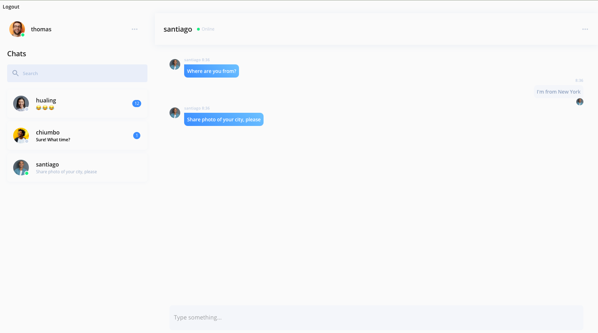

# Messenger

[](https://github.com/RichardLitt/standard-readme)

A 1:1 real-time chat full-stack web application with [PERN Stack](https://www.geeksforgeeks.org/what-is-pern-stack/) + Redux + Material-UI + Socket.IO. Create your account today and start chatting with a user by searching his/her username.

## Table of Contents

- [Usage](#usage)
	- [Initial Setup](#initial-setup)
    - [Running the Application Locally](#running-the-application-locally)
- [Roadmap](#roadmap)
- [Demo](#demo)
- [Maintainer](#maintainer)
- [Acknowledgements](#acknowledgements)

## Usage

### Initial Setup

1. Create a PostgreSQL database (these instructions may need to be adapted for your operating system).

```
psql
CREATE DATABASE messenger;
\q
```

2. Create a `.env` file in the [server directory](server) and add your session secret (this can be any string).

```
SESSION_SECRET = "your session secret"
```

3. Add the following to `.env` file you just created to connect with your local PostgreSQL. (See [db.js](server/db/db.js) and [Sequelize documentation](https://sequelize.org/master/manual/getting-started.html) to better know why we need these environment variables.)
```
DB_USER = postgres
DB_PASSWORD = "your password"
DB_NAME = messenger
DB_HOST = localhost
DB_PORT = 5432
DB_ENABLE_SSL = false
```

4. In the server folder, install dependencies and then seed the database.

```
cd server
npm install
npm run seed
```

5. In the client folder, install dependencies.

```
cd client
npm install
```

### Running the Application Locally

1. In one terminal, start the front end:

```
cd client
npm start
```

2. In a separate terminal, start the back end:

```
cd server
npm run dev
```

3. (Optional) To test with seeded users and conversations, run the command below before start the back end in the previous step.
```
npm run seed
```

## Roadmap
- [x] Store tokens in from local storage to httpOnly cookies and set expiry period to 1 day
- [x] Display messages in correct order on page load
- [x] Send messages in real-time (i.e. a user does not need to refresh the page to see new messages)
- [x] A user can only send messages to conversations between himself/herself and other users rather than to a conversation between other userA and other userB
- [x] Add read receipt by displaying a small avatar of the recipient under the latest read message
- [x] Add unread notification by displaying badges containing the number of unread messages to the center-right of the siderbar chat windows (Clear the notification only when the user clicks the siderbar chat window)
- [x] New design for login and register pages
- [x] Keep concurrent display on multiple logins of a same user. (i.e. one login does not need to refresh the page to see new messages or read status change when the operations is performed by other logins of the same account) 
- [x] Avoid duplicate chat windows when a user is searching while the target user is sending message.
- [x] Only allow authenticated user connecting to the server
- [x] Make sure a user is offline only after all loggins log out 
- [x] Modernize front-end code by converting class components to functional components
- [x] Redirect a logged in user to login page rather than register page after he/she logs out
- [x] Host client code on Netlify
- [x] Host server code on Heroku

Todo:
- [ ] Fix the bug related to CORS after deployment (i.e. grab the JWT from client and verify)
- [ ] Limit max text length
- [ ] Handle the situation when a user does not log out before close the pgae
- [ ] Some error messages do not re-render

Nice to have:
- [ ] Typing status
- [ ] Move active chat at the top of siderbar
- [ ] Only load more messages when scrolling
- [ ] Submit button in input window
- [ ] Emoji picker
- [ ] Support sending images

## [Demo](https://drive.google.com/file/d/1UvYqh6le-VdA-JLxsNn6T21u22VhZOHS/view?usp=sharing)
Accounts for demo (:warning: Do not send messages containing sensitive or private information since these are public accounts.) 
```
Username: thomas/santiago
Password: 123456

```
<p align="center">
    
    
<p>

## Maintainer
[@jia7xiong](https://github.com/jia7xiong)

## Acknowledgements
[@0916dhkim](https://github.com/0916dhkim)

[@Mayo19](https://github.com/Mayo19)

[@RayK3](https://github.com/RayK3)

[@johnsciutto](https://github.com/johnsciutto)